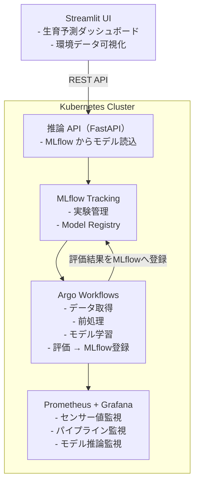

# 🌾アグリテック向け MLOps デモ（WIP）
**Kubernetes × MLflow × Argo Workflows × Prometheus/Grafana × Streamlit**

このリポジトリは、MLOpsのキャッチアップを兼ねてアグリテック領域での機械学習モデル運用を想定した**エンドツーエンドの MLOps デモ環境**を実装していくプロジェクトです。


最終的には農業データ（気温・湿度・日射量・土壌水分など）を用いて、
作物の生育ステージを予測する ML モデルを
**学習 → 管理 → デプロイ → 推論 → 可視化 → 監視**
まで一貫して実行できる構成を狙っています。


## 🌟 Use Case（ユースケース）

- 農業センサーから取得した環境データの可視化
- 生育ステージの予測（分類モデル）
- モデルの自動再学習（Argo Workflows）
- MLflow によるモデルバージョン管理
- 推論 API の自動更新
- Prometheus/Grafana による監視


## 📌 Features（できること）

### 🔬 ML モデル管理（MLflow）
- 実験管理（パラメータ・メトリクス）
- モデルのバージョン管理
- Model Registry によるデプロイ管理

### 🔁 パイプライン自動化（Argo Workflows）
- データ取得
- 前処理
- モデル学習
- 評価
- MLflow への登録
- 推論 API の自動更新

### 🌤️ Streamlit ダッシュボード
- 環境データの可視化（温度・湿度・土壌水分など）
- 生育ステージの予測
- モデル切り替え（MLflow Registry 連携）

### 📊 監視（Prometheus/Grafana）
- 推論 API のメトリクス
- パイプラインの成功率
- モデル精度の推移
- センサー値の監視（ダミーデータ可）

---

## 🏗️ Architecture（アーキテクチャ）



## 📁 Repository Structure（リポジトリ構成）

```
.
├── README.md
├── api         # FastAPI 推論サーバ
├── argo        # Argo Workflows 定義
├── data        # サンプル環境データ
├── mlflow      # MLflow 設定・モデル
├── monitoring  # 監視設定（Prometheus/Grafana）
└── streamlit   # Streamlit ダッシュボード
```


---

<!-- ## 🚀 Quick Start

### 1. Kubernetes（Kind）
```bash
kind create cluster --name agritech-mlops
```

### 2. MLflow
```bash
helm install mlflow ./helm/mlflow
```

### 3. Argo Workflows
```bash
kubectl create namespace argo
kubectl apply -n argo -f https://github.com/argoproj/argo-workflows/releases/latest/download/install.yaml
```

### 4. Monitoring
```bash
helm install monitoring ./helm/monitoring
```

### 5. Streamlit
```bash
streamlit run streamlit/app.py
``` -->

Learning Log（学習ログ公開）
このプロジェクトは、MLOps の学習過程を公開しながら構築しています。
- [Day3: Kubernetes セットアップ、Day4: MLflow の導入](doc/day3.md)
- [ Day5: Argo Workflows でパイプライン自動化](doc/day5.md)
- [ Day5 (DAG): Directed Acyclic Graph パイプライン](doc/day5_DAG.md)
- [Day6: Streamlit ダッシュボード作成](doc/day6.md)
- Day7: Prometheus/Grafana 監視構築
- Day8〜: モデル改善・自動化強化


📄 License
MIT License

