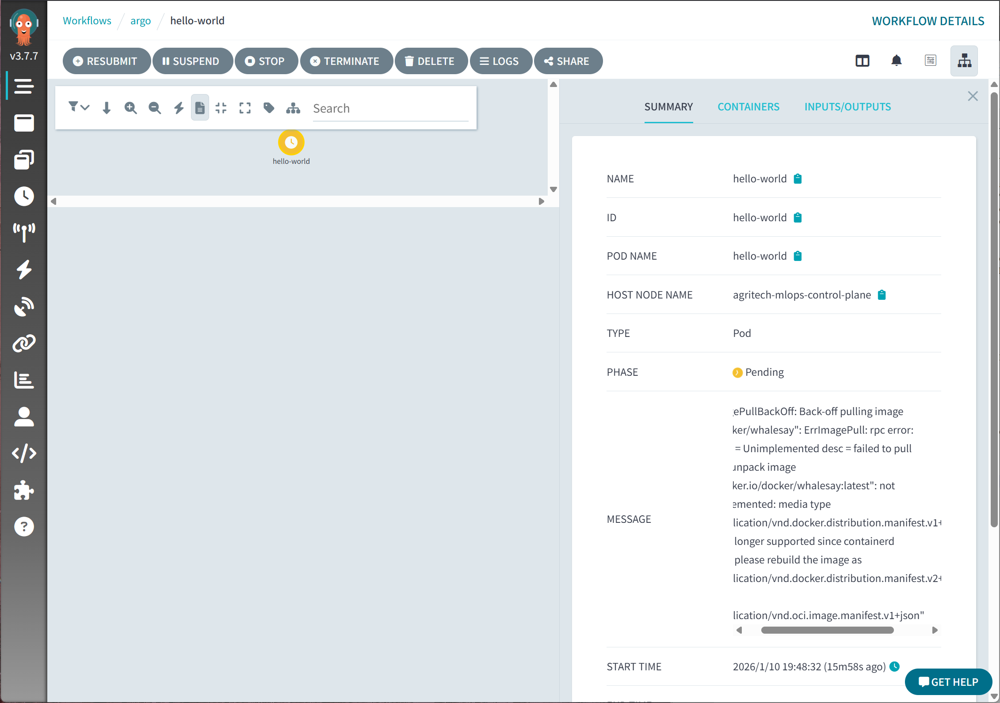

## KindでのローカルKubernetes Clusterの設定 とIngressでのnginx デプロイ
```bash
# Install Kind
[ $(uname -m) = x86_64 ] && curl -Lo ./kind https://kind.sigs.k8s.io/dl/v0.31.0/kind-linux-amd64
chmod +x ./kind
sudo mv ./kind /usr/local/bin/kind

# Create Kind Cluster
kind create cluster --name agritech-mlops
kubectl get nodes

# Kubernetes Dashboard
kubectl apply -f https://raw.githubusercontent.com/kubernetes/dashboard/v2.7.0/aio/deploy/recommended.yaml

# Deploy Nginx Demo App
kind get clusters
kubectl apply -f nginx-deploy.yaml
kubectl apply -f nginx-svc.yaml
kubectl get pods
# kind-config.yaml でポートマッピング設定をしているので、ホストの 30080 ポートでアクセス可能
curl localhost:30080


#---- うまくいかないときのデバッグ用コマンド ----#
# Debugging Commands
kubectl get svc nginx-demo-svc -o wide && kubectl get pods -o wide --selector=app=nginx-demo || true && kubectl get endpoints nginx-demo-svc -o yaml || true && kubectl get nodes -o wide || true && kubectl describe svc nginx-demo-svc || true
# Check host port mapping
ss -ltnp | grep 30080
docker ps
kubectl get nodes -o wide
# Access from inside the Kind control-plane container
docker exec -it agritech-mlops-control-plane bash -c "curl -v localhost:30080 || true"
docker exec -it agritech-mlops-control-plane bash -c "curl -v 10.244.0.7:80 || true"
kubectl get endpoints nginx-demo-svc -o yaml
# Check kube-proxy logs
kubectl -n kube-system get pods
kubectl -n kube-system logs -l k8s-app=kube-proxy --tail=200
sudo iptables -t nat -S | grep 30080 || sudo nft list ruleset | grep -n 30080 || true


# Nginx Ingress Controller をインストール
kubectl apply -f https://raw.githubusercontent.com/kubernetes/ingress-nginx/main/deploy/static/provider/kind/deploy.yaml

# Pod が Ready になるまで待つ
kubectl get pods -n ingress-nginx
kubectl apply -f nginx-ingress.yaml
# /etc/hosts に nginx.local を追加（すでに追加済みの場合はスキップ）
sudo sh -c 'echo "127.0.0.1 nginx.local" >> /etc/hosts'
# windows 上でブラウザを使用する場合は PowerShell を管理者権限で起動して以下を実行
Add-Content -Path "C:\Windows\System32\drivers\etc\hosts" -Value "127.0.0.1 nginx.local"

# Ingress の動作確認
kubectl apply -f nginx-ingress.yaml
kubectl get ingress
kubectl describe ingress nginx-demo-ingress
curl http://nginx.local
```


## MLflow のデプロイ
```bash
# Create mlflow namespace
kubectl create namespace mlflow

kubectl apply -f mlflow-deploy.yaml
kubectl apply -f mlflow-svc.yaml
kubectl apply -f mlflow-ingress.yaml
kubectl get pods -n mlflow
curl http://mlflow.local
```
ブラウザで確認
http://mlflow.local


## Argo Workflows のデプロイ
```bash
# Argo Workflows のインストール
kubectl create namespace argo
kubectl apply -n argo -f https://github.com/argoproj/argo-workflows/releases/latest/download/install.yaml
kubectl -n argo get pods
# Argo Server のログ確認
kubectl logs -n argo deploy/argo-server

# Argo Workflows Ingress の設定
kubectl apply -f argo-ingress.yaml
kubectl rollout restart deployment/argo-server -n argo

# scripts/create-argo-secret.sh を実行して自己署名証明書を作成し、Kubernetes シークレットに登録
./scripts/create-argo-secret.sh

# Argo Server を認証なし（client 認証無効）で起動
kubectl patch deployment argo-server -n argo --type='json' \
  -p='[{"op":"replace","path":"/spec/template/spec/containers/0/args","value":["server","--auth-mode=server"]}]'
kubectl rollout status deployment/argo-server -n argo
```
### argoの認証なし設定について
[ローカル向け：Argo 認証を一時的に無効化する手順](doc/local-auth.md)


## Hello World ワークフローの実行
```bash
kubectl apply -f hello-world.yaml -n argo
```
## Argo Workflows の動作確認
ブラウザで確認
https://argo.local/workflows/argo




## まとめ：Kind クラスターに Nginx、MLflow、Argo Workflows をデプロイする完全スクリプト例
```bash
# Recreate cluster with ingress-ready node label ポートの再マッピング時
kind delete cluster --name agritech-mlops
kind create cluster --name agritech-mlops --config kind-config.yaml

# Nginx Demo App
kubectl apply -f nginx-deploy.yaml
kubectl apply -f nginx-svc.yaml
kubectl apply -f https://raw.githubusercontent.com/kubernetes/ingress-nginx/main/deploy/static/provider/kind/deploy.yaml
# Pod が Ready になるまで待つ
kubectl get pods -n ingress-nginx
kubectl apply -f nginx-ingress.yaml

# MLflow
kubectl create namespace mlflow
kubectl apply -f mlflow-deploy.yaml -n mlflow
kubectl apply -f mlflow-svc.yaml -n mlflow
kubectl apply -f mlflow-ingress.yaml -n mlflow
# Status check
kubectl get pods -n mlflow

# Argo（namespace が必要）
kubectl create namespace argo
kubectl apply -n argo -f https://github.com/argoproj/argo-workflows/releases/latest/download/install.yaml
kubectl apply -f argo-ingress.yaml -n argo
# Create and apply TLS secret for Argo
./scripts/create-argo-secret.sh

kubectl patch deployment argo-server -n argo --type='json' \
  -p='[{"op":"replace","path":"/spec/template/spec/containers/0/args","value":["server","--auth-mode=server"]}]'
kubectl rollout status deployment/argo-server -n argo
```


## 参考

```bash
# ARGOがSSL接続を期待しているので設定を追加して接続確認（自己署名証明書による検証）
#証明書検証を無視して接続確認
curl -v -k https://argo.local

# mkcert のインストールと argo.local 用の信頼された証明書作成
sudo apt install libnss3-tools
curl -JLO \"https://dl.filippo.io/mkcert/latest?for=linux/amd64\" && chmod +x mkcert && sudo mv mkcert /usr/local/bin/
mkcert -install
mkcert argo.local
# 生成した cert を Kubernetes シークレットにする
kubectl create secret tls argo-tls --cert=argo.local.pem --key=argo.local-key.pem -n argo
# Ingress に TLS 設定を入れて適用
kubectl apply -f argo-ingress.yaml
```


```bash
# deployを更新したときの再デプロイ手順
kubectl apply -f mlflow-deploy.yaml -n mlflow
kubectl apply -f mlflow-ingress.yaml -n mlflow
kubectl rollout restart deployment/mlflow -n mlflow
sleep 3
kubectl -n mlflow get pods -o wide
echo '---'
kubectl -n mlflow logs -l app=mlflow --tail=50
kubectl -n ingress-nginx logs deployment/ingress-nginx-controller --tail=80 | tail -n 80
# 確認コマンド
kubectl -n mlflow get deployment mlflow -o yaml
kubectl -n mlflow get pods -l app=mlflow -o jsonpath='{.items[0].metadata.name}'
```


