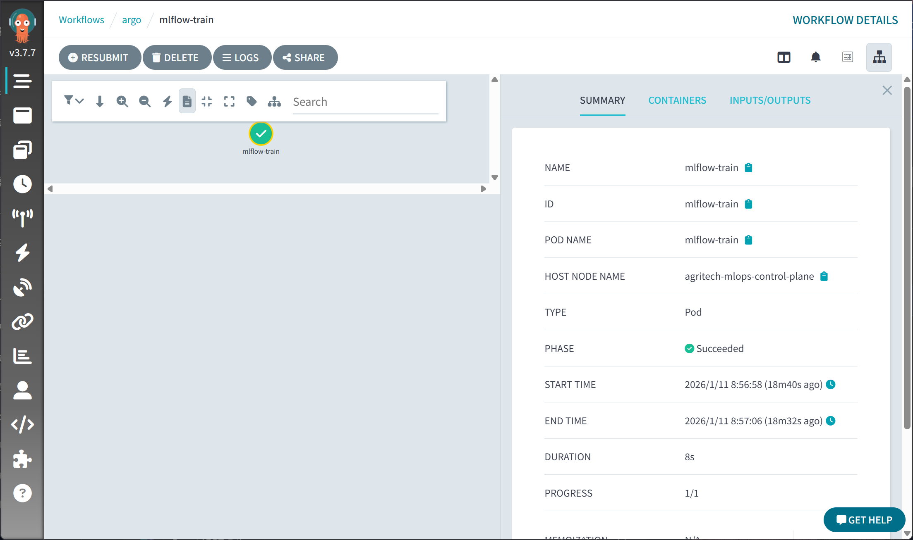

# MLflow にログを送る Argo Workflow を作る

## 学習用 Python スクリプトを作成する
- train.py作成


## スクリプトを動かす Docker イメージを作成する
- Dockerfile作成


## Docker イメージをビルドして、ローカルの Docker レジストリにプッシュする
```bash
# kind クラスターのノードにローカルの Docker レジストリを接続
docker network connect kind registry

# ローカルの Docker レジストリを起動 mlflowがポート5000を使うので、5001にマッピング
docker run -d --restart=always -p 5001:5000 --name registry registry:2
# Docker イメージのビルド
docker build -t registry5001:5000/mlflow-argo-train:latest -f Dockerfile .
# ローカルの Docker レジストリにプッシュ
docker push registry5001:5000/mlflow-argo-train:latest
# Argo Workflow 定義ファイル（mlflow-train-workflow.yaml）を作成して、Argo Workflows に適用する
kubectl apply -f mlflow-train-workflow.yaml

# kind クラスターの設定ファイル（kind-config.yaml）に以下を追加して、ポートをマッピングする
kind: Cluster
apiVersion: kind.x-k8s.io/v1alpha4
containerdConfigPatches:
- |-
  [plugins."io.containerd.grpc.v1.cri".registry.mirrors]
    [plugins."io.containerd.grpc.v1.cri".registry.mirrors."registry5001:5000"]
      endpoint = ["http://registry5001:5000"]
```

## RBAC 設定を確認する
`wait: Error (exit code 64): workflowtaskresults.argoproj.io is forbidden: User "system:serviceaccount:argo:default" cannot create resource "workflowtaskresults" in API group "argoproj.io" in the namespace "argo"`エラーが出た場合RBAC設定を確認する

作成したマニフェスト
- Role（namespace: argo）: workflowtaskresults に対する create/get/list/watch/update/patch/delete を許可
- RoleBinding（namespace: argo）: Role を ServiceAccount: default（namespace: argo）にバインド
```bash
cat <<'EOF' | kubectl apply -f -
apiVersion: rbac.authorization.k8s.io/v1
kind: Role
metadata:
  name: argo-workflowtaskresults-role
  namespace: argo
rules:
- apiGroups: ["argoproj.io"]
  resources: ["workflowtaskresults"]
  verbs: ["create","get","list","watch","update","patch","delete"]
---
apiVersion: rbac.authorization.k8s.io/v1
kind: RoleBinding
metadata:
  name: argo-workflowtaskresults-binding
  namespace: argo
subjects:
- kind: ServiceAccount
  name: default
  namespace: argo
roleRef:
  kind: Role
  name: argo-workflowtaskresults-role
  apiGroup: rbac.authorization.k8s.io
EOF
```
- 権限確認:
```bash
kubectl auth can-i create workflowtaskresults --as=system:serviceaccount:argo:default -n argo
```


## Argo UI で確認する
ブラウザで確認
https://argo.local/workflows/argo/mlflow-train



## Argo Workflows でワークフローを作成に関連する操作
```bash
# Argo Workflows でワークフローを作成する
kubectl apply -f mlflow-train-workflow.yaml

# MLflow サーバーのデプロイ設定を更新して、ワークフローを再実行する
kubectl apply -f mlflow-deploy.yaml -n mlflow
kubectl -n mlflow rollout restart deployment/mlflow
# 変更後のログを確認
kubectl -n mlflow logs deploy/mlflow -f --tail=200
# 変更が反映されたか確認
kubectl -n mlflow get deployment mlflow -o yaml | sed -n '30,120p'
# # Re-run the Argo workflow (use argo CLI or kubectl/Workflow submit method)
# argo submit mlflow-train-workflow.yaml -n argo
# or, if using kubectl to create the workflow resource:
kubectl -n argo create -f mlflow-train-workflow.yaml
```

## Argo Workflows でワークフローを再実行する
```bash
kubectl -n argo delete workflow mlflow-train || true
kubectl -n argo create -f mlflow-train-workflow.yaml
```


## 監視・状態確認（参考）
```bash
# ワークフローの一覧を取得
kubectl get wf -n argo

# ワークフローの状態を確認する
kubectl -n argo get workflows mlflow-train -o wide

# または Pod を確認してログを見る
kubectl -n argo get pods -l workflows.argoproj.io/workflow=mlflow-train
kubectl -n argo logs mlflow-train   # 失敗/完了した Pod の名前を指定
kubectl -n argo logs <pod-name> -c main # コンテナ名がある場合
```


## Argo Workflows で学習スクリプトを ConfigMap 経由で渡す方法
```bash
# train.py を ConfigMap として作成する
kubectl -n argo create configmap mlflow-train-script --from-file=train.py --dry-run=client -o yaml | kubectl apply -f -
# mlflow-train-workflow.yaml の container セクションに volumeMounts と volumes を追加する
# 部分抜粋: templates[].name: train
- name: train
  container:
    image: registry5001:5000/mlflow-argo-train:latest
    command: ["python"]
    args: ["/train.py"]
    env:
    - name: MLFLOW_TRACKING_URI
      value: "http://mlflow-svc.mlflow.svc.cluster.local:5000"
    volumeMounts:
    - name: train-script
      mountPath: /train.py
      subPath: train.py
  volumes:
  - name: train-script
    configMap:
      name: mlflow-train-script
      items:
      - key: train.py
        path: train.py

# ワークフローを再適用して実行する
kubectl -n argo delete workflow mlflow-train || true
kubectl -n argo create -f mlflow-train-workflow.yaml


# train.py を修正した場合、ConfigMap を更新してワークフローを再実行する
kubectl -n argo create configmap mlflow-train-script --from-file=train.py --dry-run=client -o yaml | kubectl apply -f -
kubectl -n argo delete workflow mlflow-train || true
kubectl -n argo create -f mlflow-train-workflow.yaml
```
