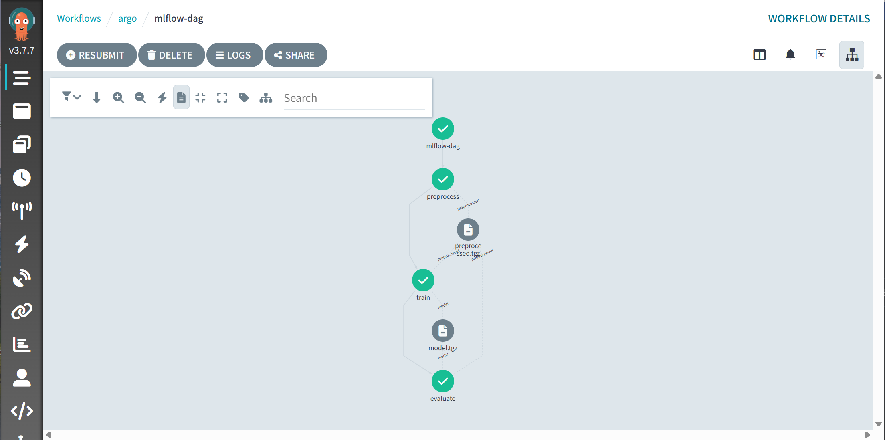
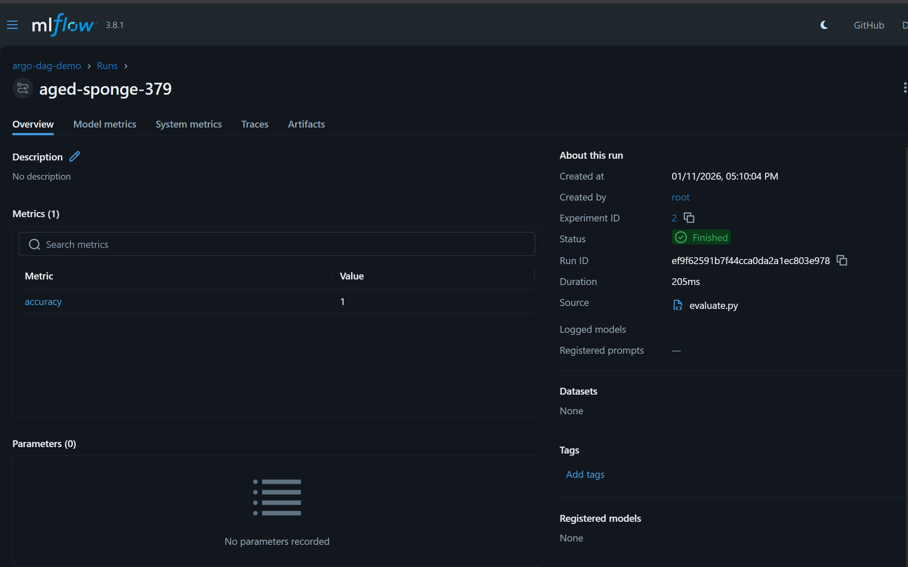

# DAGパイプラインの作成と実行
Argo Workflows を使って DAG（Directed Acyclic Graph） パイプラインを作成し、MLflow を使ったモデル学習を実行します。

## preprocessing -> training -> evaluation の順にタスクが実行される DAG パイプラインを作成します。
pipelines/dag/ に
```bash
preprocess.py
train.py
evaluate.py
Dockerfile
```
を作成


```bash
# Docker イメージのビルド  localhost:5001 にタグを付ける
docker build -t registry5001:5000/mlflow-dag:latest -f pipelines/dag/Dockerfile pipelines/dag
docker tag registry5001:5000/mlflow-dag:latest localhost:5001/mlflow-dag:latest
# ローカルの Docker レジストリにプッシュ
# docker push registry5001:5000/mlflow-dag:latest
docker push localhost:5001/mlflow-dag:latest
# Argo Workflow 定義ファイル（mlflow-dag-workflow.yaml）を作成して、Argo Workflows に適用する
kubectl apply -f mlflow-dag-workflow.yaml
```

## mlflow-dag-workflow.yaml を作成
mlflow-dag-workflow.yaml に DAG ワークフローを定義します。


```bash
# ワークフローが参照しているイメージ名を確認する
kubectl -n argo get workflow mlflow-dag -o yaml | grep "image:" -n || true

# kind に「そのままの名前」でイメージをロードする（イメージ名が registry5001:5000/... ならそちらを、localhost:5001/... ならそちらを指定）
# 必ず👆で表示されたワークフローの image: と同じ完全なリポジトリ名を使うこと
# 例：Workflow が registry5001:5000/mlflow-dag:latest を参照しているなら
kind load docker-image registry5001:5000/mlflow-dag:latest --name agritech-mlops

# または Workflow が localhost:5001/mlflow-dag:latest を参照しているなら
kind load docker-image localhost:5001/mlflow-dag:latest --name agritech-mlops


# kind ノード上にイメージが載っているか確認
# kind control-plane コンテナ名を確認してから実行（クラスタ名が agritech-mlops の場合）
docker exec -it agritech-mlops-control-plane ctr -n k8s.io images ls | grep mlflow-dag || true

# ワークフローを再実行する
kubectl -n argo delete workflow mlflow-dag || true
kubectl -n argo create -f pipelines/dag/mlflow-dag-workflow.yaml
# or delete failing pod to force restart:
kubectl -n argo get pods -l workflows.argoproj.io/workflow=mlflow-dag
kubectl -n argo delete pod <問題の-pod-name> || true
```


## MinIO のデプロイ（参考）
```bash
# MinIO の Docker イメージのタグ一覧を確認（必要に応じてバージョンを指定して使用）
curl -s "https://registry.hub.docker.com/v2/repositories/minio/minio/tags?page_size=100" | jq -r '.results[].name' | head -n 20

# MinIO を Helm チャートでインストール
# helm repo add minio https://charts.min.io/
helm repo add bitnami https://charts.bitnami.com/bitnami
helm repo update
helm install minio bitnami/minio --namespace argo --create-namespace \
  --set accessKey=minio \
  --set secretKey=minio123 \
  --set defaultBucket.enabled=true \
  --set defaultBucket.name=argo-artifacts \
  --set auth.rootUser=minio,auth.rootPassword=minio123 \
  --set image.repository=minio/minio \
  --set image.tag=RELEASE.2025-07-23T15-54-02Z \
  --set global.security.allowInsecureImages=true

# kind ノードに MinIO イメージをロードする
kind load docker-image minio/minio:RELEASE.2025-07-23T15-54-02Z --name agritech-mlops
# minioのイメージがあるか確認
docker exec -it agritech-mlops-control-plane ctr -n k8s.io images ls | grep minio || true
# Helm を使って MinIO をインストールする場合の例（minio-values.yaml を使用）
helm upgrade --install minio bitnami/minio -n argo --create-namespace -f minio-values.yaml --wait --timeout=300s


# Kubernetes シークレットを作成して Argo Workflows から MinIO にアクセスできるようにする
kubectl -n argo create secret generic minio-cred --from-literal=accesskey=minio --from-literal=secretkey=minio123 --dry-run=client -o yaml | kubectl apply -f -
# Argo Workflows のアーティファクト設定を更新して MinIO を使用するようにする
kubectl -n argo apply -f argo-artifact-config.yaml
# workflow-controller デプロイメントを再起動して設定を反映させる
kubectl -n argo rollout restart deployment/workflow-controller || true
sleep 3
kubectl -n argo get pods -o wide &&
kubectl -n argo get svc minio -o wide || true &&
kubectl -n argo get endpoints minio -o wide || true &&
kubectl -n argo get pvc -l app.kubernetes.io/instance=minio -o wide || true

# kind ノードに MinIO クライアント(mc)イメージをロードする（必要に応じて）
bash -lc 'docker pull docker.io/minio/mc:latest && kind load docker-image docker.io/minio/mc:latest --name agritech-mlops || true'
# MinIO クライアント(mc)のインストール
sudo curl -fsSL https://dl.min.io/client/mc/release/linux-amd64/mc -o /usr/local/bin/mc
sudo chmod +x /usr/local/bin/mc
mc --version

# MinIO サーバーにポートフォワードしてローカルからアクセスできるようにする
kubectl -n argo port-forward svc/minio 9000:9000
# MINIO_BROWSER=on が既存設定にある場合、Helm チャートの values.yaml で設定すると重複エラーになるため、パッチを当てた charts/minio を使用する
helm upgrade --install minio ./charts/minio -n argo -f minio-values.yaml


# ワークフローを再実行する
kubectl -n argo delete workflow mlflow-dag || true
kubectl -n argo create -f pipelines/dag/mlflow-dag-workflow.yaml

```





## トラブルシューティング（参考）
```bash
# トラブルシューティング: kind ノードからローカルの Docker レジストリにアクセスできるか確認
docker exec -it agritech-mlops-control-plane curl -v http://registry5001:5000/v2/ || true

# ワークフローの状態を確認
kubectl -n argo get workflows mlflow-dag -o wide
# Argo ワークフローの Pod ログを確認
kubectl -n argo get pods -l workflows.argoproj.io/workflow=mlflow-dag  -o wide
kubectl -n argo logs mlflow-dag-preprocess-141008107 -c main
# kubectl -n argo logs <preprocess-pod-name> -c main
# kubectl -n argo logs <train-pod-name> -c main
# kubectl -n argo logs <evaluate-pod-name> -c main
# Pod の詳細情報を確認
kubectl -n argo describe pod mlflow-dag-preprocess-141008107
kubectl -n argo get pod mlflow-dag-preprocess-141008107 -o jsonpath='{.status.containerStatuses[*].name} {.status.containerStatuses[*].state}' ; echo
```


## minio導入のトラブルシューティング
```bash
# MinIO 関連リソースの確認
kubectl -n argo get pods,svc,endpoints | grep -E "minio|argo-artifacts" -n || true
kubectl -n argo get secret minio-cred -o yaml || true
kubectl -n argo describe svc minio || true
kubectl -n argo get endpoints minio -o wide || true

=> Endpoints が空の場合、MinIO Pod が正常に起動していない可能性があります。=> imageがpullできていない等
# MinIO Pod の詳細確認
kubectl -n argo get pods -l app.kubernetes.io/instance=minio -o wide || true
kubectl -n argo describe pod <minio-pod-name>   # Events を確認
# マニフェスト／ワークフローが参照する image 名の確認
kubectl -n argo get workflow mlflow-dag -o yaml | grep "image:" -n || true
kubectl -n argo get pods -l app.kubernetes.io/instance=minio -o yaml | grep image || true
# Pod 上で使用されているイメージ名の確認
kubectl -n argo get pods -o jsonpath='{.items[*].spec.containers[*].image}' ; echo
# もしイメージが pull できていない場合、kind ノードにイメージをロードする
kind load docker-image docker.io/minio/minio:RELEASE.2025-07-23T15-54-02Z --name agritech-mlops
```


## helm の使用（参考）
```bash

# リリース状態確認:
helm list -n argo

# 通常のアンインストール:
helm uninstall minio -n argo

# もしアンインストールが失敗して「still in use」のままなら（リリースのシークレットが残っている場合）、Helm のシークレットを手動で削除:
kubectl -n argo get secret minio -o yaml || true

kubectl -n argo get secret | grep sh.helm.release.v1.minio || true
kubectl -n argo delete secret -l name=minio -n argo || \
kubectl -n argo get secret --no-headers -o name | grep minio | xargs -r kubectl -n argo delete

# さらに Kubernetes に残ったリソースを確認して削除（例: Deploy/Service/PVC 等）:
kubectl -n argo get all -l release=minio
kubectl -n argo delete all -l release=minio
kubectl -n argo get pvc -l release=minio
kubectl -n argo delete pvc -l release=minio

# それでも残る場合（ラベルが違う等）、名前で確認して削除:
kubectl -n argo get all
kubectl -n argo delete deployment,minio --ignore-not-found
kubectl -n argo delete svc,minio --ignore-not-found

# 最後に Helm のシークレットが残っていないか再確認して削除:
kubectl -n argo delete secret -l name=minio -n argo || kubectl -n argo get secret --no-headers -o name | grep minio | xargs -r kubectl -n argo delete
```


