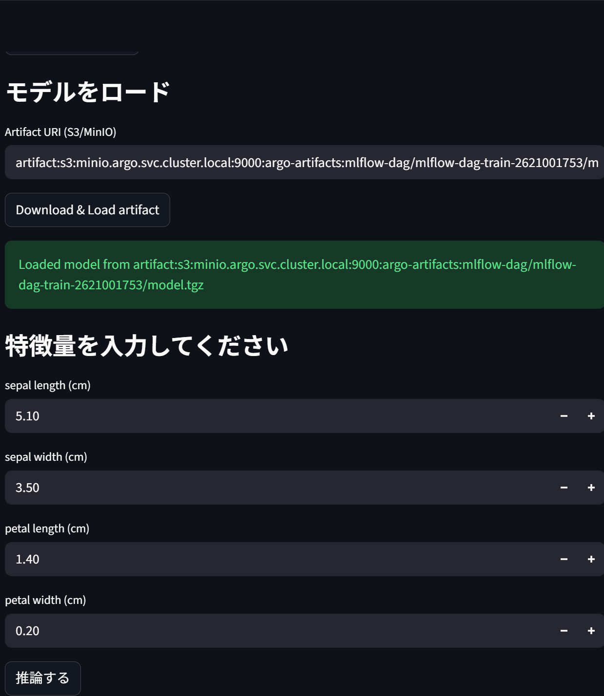
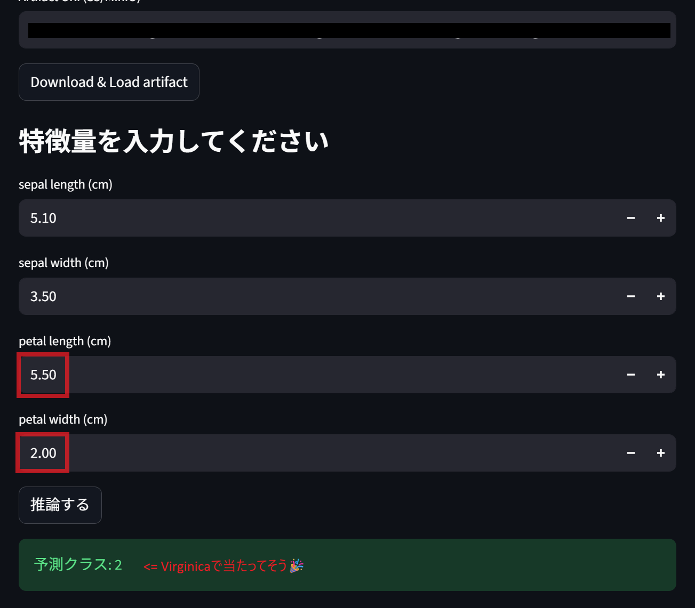

# Streamlit Iris 推論ダッシュボード

## 全体像：Streamlit 推論ダッシュボードの構成
- MLflow で保存されたモデルをロード
- ユーザーが入力（例：Iris の特徴量）
- モデルで推論
- 結果を画面に表示
最終的には Kubernetes 上で動かして
http://streamlit.local

でアクセスできるようにする。

### Step 1：Streamlit アプリを作る
app.py を作成
s3_utils.py (s3バケット操作用ユーティリティ)を作成


### Step 2：Dockerfile を作成
Dockerfile を作成し、Streamlit アプリをコンテナ化する。
```bash
# Docker イメージのビルド  localhost:5001 にタグを付ける
docker build -t registry5001:5000/streamlit-iris:latest -f streamlit/Dockerfile streamlit
docker tag registry5001:5000/streamlit-iris:latest localhost:5001/streamlit-iris:latest
# ローカルの Docker レジストリにプッシュ ー＞ kindにロードする場合は不要
# docker push registry5001:5000/streamlit-iris:latest
docker push localhost:5001/streamlit-iris:latest
```

### Step 3：Kubernetes Deployment を作成
Kubernetes マニフェストを作成し、Streamlit アプリをデプロイする。
Kubernetes Deployment を作成する。
Kubernetes Service を作成する。
Kubernetes Ingress を作成し、外部からのアクセスを可能にする。
```bash
kubectl apply -f streamlit/streamlit-deploy.yaml
kubectl apply -f streamlit/streamlit-svc.yaml
kubectl apply -f streamlit/streamlit-ingress.yaml
```

### Step 4：kind ノードにイメージをロード
```bash
# ワークフローが参照しているイメージ名を確認する
kubectl -n mlflow get deployment streamlit -o yaml | grep "image:" -n || true

# kind に「そのままの名前」でイメージをロードする（イメージ名が registry5001:5000/... ならそちらを、localhost:5001/... ならそちらを指定）
# 必ず👆で表示された Deployment の image: と同じ完全なリポ
# 例：Deployment が registry5001:5000/streamlit-iris:latest を参照しているなら
#kind load docker-image registry5001:5000/streamlit-iris:latest --name agritech-mlops
# または Deployment が localhost:5001/streamlit-iris:latest を参照しているなら
kind load docker-image localhost:5001/streamlit-iris:latest --name agritech-mlops
# kind ノード上にイメージが載っているか確認
# kind control-plane コンテナ名を確認してから実行（クラスタ名が agritech-mlops の場合）
docker exec -it agritech-mlops-control-plane ctr -n k8s.io images ls | grep streamlit-iris || true
# Deployment を再起動する
kubectl -n mlflow rollout restart deployment/streamlit
kubectl -n mlflow rollout status deployment/streamlit

#  MinIO サービスへのポートフォワードを維持するための軽量コンテナを起動
# ローカル:9000 ←→ cluster svc/minio:9000 ←→ pod:9000
export KUBECONFIG=$HOME/.kube
docker compose -f docker/minio-pf/docker-compose.yml up -d
```
- [MinIO サービスへのポートフォワードを維持するための軽量コンテナについて](../docker/minio-pf/README.md)


### Step 6：hosts に追加
```bash
sudo sh -c 'echo "127.0.0.1 streamlit.local" >> /etc/hosts'
```

### Step 7：アクセス！
curl http://streamlit.local
http://streamlit.local




---

## app.py修正時の再デプロイ手順
```bash
docker build -t registry5001:5000/streamlit-iris:latest -f streamlit/Dockerfile streamlit
docker tag registry5001:5000/streamlit-iris:latest localhost:5001/streamlit-iris:latest
kind load docker-image localhost:5001/streamlit-iris:latest --name agritech-mlops
kubectl -n mlflow rollout restart deployment/streamlit
```


## トラブルシューティング
```bash
# 動かない場合は Pod を削除して再作成を試みる
kubectl -n mlflow get pods -l app=streamlit
kubectl -n mlflow delete pod <問題の-pod-name> || true


# Ingress の状態を確認
kubectl get ingress -A -o wide && echo '---' && kubectl -n ingress-nginx get pods -o wide
# さらに詳細に確認したい場合
kubectl -n mlflow get deploy,sts,po,svc,endpoints -o wide && echo '--- describe streamlit ingress ---' && kubectl -n mlflow describe ingress streamlit-ingress
# Streamlit Pod の詳細を確認
kubectl -n mlflow describe pod streamlit-79575fc5b6-9xzms


# kind にローカルイメージを載せて、Deployment を再起動して Pod 状態を確認
kind load docker-image localhost:5001/streamlit-iris:latest --name agritech-mlops && kubectl -n mlflow rollout restart deployment/streamlit && kubectl -n mlflow get pods -o wide && kubectl -n mlflow get svc,endpoints -o wide
# ImagePullBackOff と新しく作られた Pod の詳細イベントを確認
kubectl -n mlflow describe pod streamlit-7d86b4fbc4-j4vr2 || true && echo '---' && kubectl -n mlflow describe pod streamlit-654d4c8849-jhfln || true && echo '--- pods ---' && kubectl -n mlflow get pods -o wide
# Deployment のコンテナ設定（imagePullPolicy）を確認
kubectl -n mlflow get deployment streamlit -o yaml
# imagePullPolicy を IfNotPresent に変更して再起動
kubectl -n mlflow patch deployment streamlit -p '{"spec":{"template":{"spec":{"containers":[{"name":"streamlit","imagePullPolicy":"IfNotPresent"}]}}}}' && kubectl -n mlflow rollout restart deployment/streamlit && kubectl -n mlflow get pods -o wide && kubectl -n mlflow get svc,endpoints -o wide
#  👉streamlit-deploy.yamlに追記
#    imagePullPolicy: IfNotPresent

# Streamlit サービスのエンドポイントを確認して curl でアクセス確認
kubectl -n mlflow get endpoints streamlit-svc -o yaml && echo '--- curl ---' && curl -I http://streamlit.local || true


# Service / Endpoints 確認:
kubectl describe svc minio -n argo
kubectl get endpoints minio -n argo -o yaml
# Pod 確認:
kubectl get pod -n argo -o wide #（対象 Pod の IP/Node 確認）
# port-forward プロセス確認（ローカルで実行している場合）:
ps aux | grep port-forward
curl -I http://localhost:9000
# NodePort 到達性確認:
curl -I --connect-timeout 5 http://<NODE_IP>:30090
#（失敗する場合はルーティング／ファイアウォールが原因）
#コンテナ版 port-forward を使っているか:
docker ps | grep minio-pf
docker logs minio-pf
```

