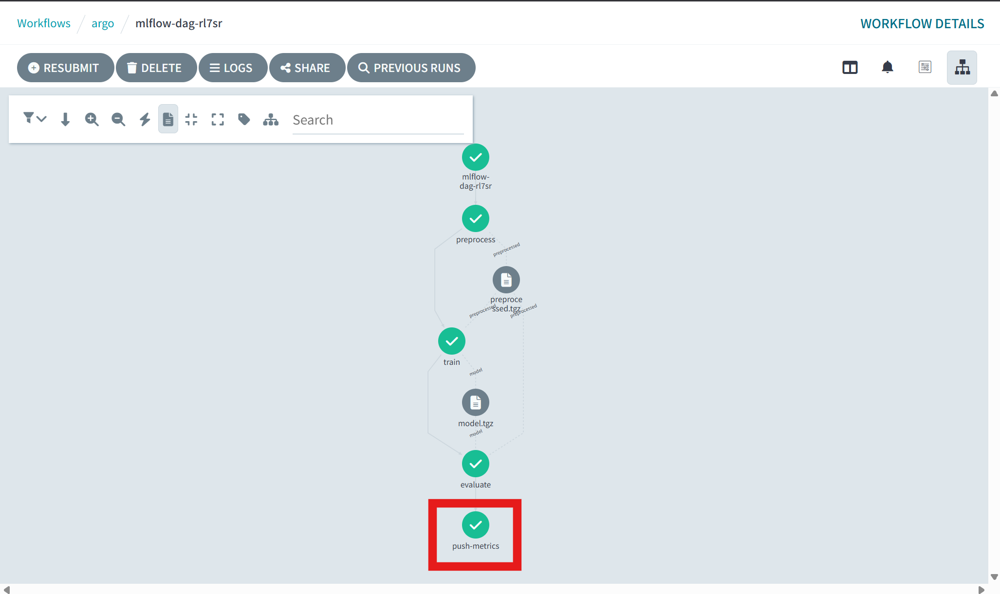
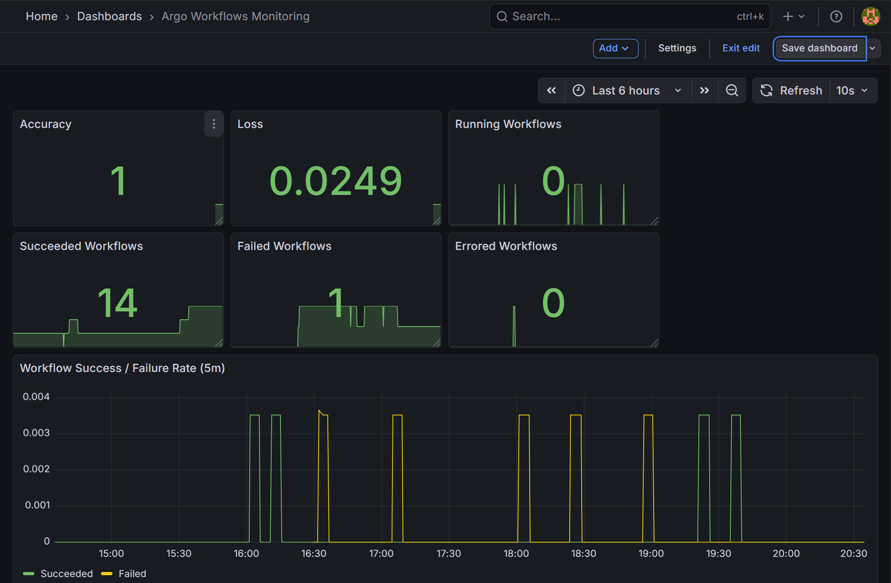

# メトリクスの設定

### Grafana のポートフォワード
```bash
export POD_NAME=$(kubectl --namespace monitoring get pod -l "app.kubernetes.io/name=grafana,app.kubernetes.io/instance=kube-prometheus-stack" -oname)
kubectl --namespace monitoring port-forward $POD_NAME 3000
```

### Prometheus のポートフォワード
```bash
kubectl -n monitoring port-forward svc/kube-prometheus-stack-prometheus 9090:9090

curl -v http://127.0.0.1:9090/metrics || true
```

### serviceMonitor/monitoring/argo-workflows/0 のエンドポイントhttps://10.244.0.26:9090/metricsにブラウザからアクセスする方法

```bash
# UIで serviceMonitor/monitoring/argo-workflows/0 のLabelsを確認
container="workflow-controller"
endpoint="metrics"
instance="10.244.0.26:9090"
job="workflow-controller-metrics"
namespace="argo"
pod="workflow-controller-5f774db4d5-hgkwk"
service="workflow-controller-metrics"


# Pod をリストして確認
kubectl -n argo get pods -l app=workflow-controller -o wide

#  Pod の詳細を確認
kubectl -n argo describe pod workflow-controller-5f774db4d5-hgkwk

# workflow-controller-metrics Service がどの Pod をターゲットにしているか確認を確認
kubectl -n argo get svc workflow-controller-metrics -o yaml

# workflow-controllerのPod をリストして確認
kubectl -n argo get pods -l app=workflow-controller -o wide

# workflow-controller-metrics Service がどのエンドポイントにルーティングしているかを確認
kubectl -n argo get endpoints workflow-controller-metrics -o yaml
export POD_NAME=$(kubectl -n argo get endpoints workflow-controller-metrics -o jsonpath="{.subsets[0].addresses[0].targetRef.name}")
kubectl -n argo port-forward pod/$POD_NAME 9090:9090

curl -v http://localhost:9090/metrics || true
```


### serviceMonitor/monitoring/mlflow-exporter/0 のエンドポイントhttp://10.244.0.59:8000/metrics にブラウザからアクセスする方法

```bash
# UIで serviceMonitor/monitoring/mlflow-exporter/0 のLabelsを確認
container="exporter"
endpoint="metrics"
instance="10.244.0.59:8000"
job="mlflow-exporter"
namespace="mlflow"
pod="mlflow-exporter-7866946c9c-bmrmv"
service="mlflow-exporter"

# Pod をリストして確認
kubectl -n mlflow get pods -l app=mlflow-exporter -o wide

#  Pod の詳細を確認
kubectl -n mlflow describe pod mlflow-exporter-7866946c9c-bmrmv

# mlflow-exporter Service がどの Pod をターゲットにしているか確認を確認
kubectl -n mlflow get svc mlflow-exporter -o yaml

# mlflow-exporterのPod をリストして確認
kubectl -n mlflow get pods -l app=mlflow-exporter -o wide

# mlflow-exporter Service がどのエンドポイントにルーティングしているかを確認
kubectl -n mlflow get endpoints mlflow-exporter -o yaml

# mlflow-exporter Service がどのエンドポイントにルーティングしているかを確認
kubectl -n mlflow get endpoints mlflow-exporter -o yaml
export POD_NAME=$(kubectl -n mlflow get endpoints mlflow-exporter -o jsonpath="{.subsets[0].addresses[0].targetRef.name}")
kubectl -n mlflow port-forward pod/$POD_NAME 8001:8000

curl -v http://localhost:8001/metrics || true

```


### Argo Workflows → Prometheus → Grafana で accuracy / loss を可視化する仕組み

ステップ 1：Pushgateway をデプロイ
```bash
helm install pushgateway prometheus-community/prometheus-pushgateway -n monitoring

# Service 名は
# pushgateway.monitoring.svc.cluster.local:9091
```

pushgateway の ServiceMonitor を追加
monitoring/pushgateway-servicemonitor.yamlを作成
```bash
kubectl apply -f monitoring/pushgateway-servicemonitor.yaml
```


ステップ 3：Argo Workflow の中で accuracy/loss を Push
pipelines/dag/mlflow-dag-workflow.yaml の中にpush-metricsを追加
```bash
docker build -t registry5001:5000/mlflow-dag:latest -f pipelines/dag/Dockerfile pipelines/dag
docker tag registry5001:5000/mlflow-dag:latest localhost:5001/mlflow-dag:latest
kind load docker-image localhost:5001/mlflow-dag:latest --name agritech-mlops
kubectl -n argo delete workflow mlflow-dag || true
kubectl -n argo create -f pipelines/dag/mlflow-dag-workflow.yaml
```






### トラブルシューティング
```bash
# Service の確認
kubectl -n monitoring get svc

# Pushgateway の Service 詳細を確認
kubectl -n monitoring describe svc pushgateway-prometheus-pushgateway

kubectl -n monitoring port-forward svc/kube-prometheus-stack-prometheus 9091:9091

echo "model_accuracy 0.95" | curl --data-binary @- http://localhost:9091/metrics/job/model_training


kubectl -n monitoring port-forward svc/pushgateway-prometheus-pushgateway 9091:9091
http://localhost:9091/
#でつながったがmetricsメニューの表示は空だった

echo "model_accuracy 0.95" | curl --data-binary @- http://localhost:9091/metrics/job/model_training
# でmetricsメニューに表示された
# -> Pushgateway の設定は正しい
# -> Argo Workflow の push-metrics ステップの確認が必要 -> ailed to resolve 'pushgateway.monitoring.svc.cluster.local' ([Errno -2] Name or service not known)"))

```
<details>
<summary>コマンド</summary>

```bash
kubectl -n monitoring get svc -o wide
kubectl -n monitoring get endpoints -o yaml | sed -n '1,200p'
kubectl -n monitoring get pods -o wide


kubectl -n monitoring get endpoints pushgateway-prometheus-pushgateway -o yaml
kubectl -n monitoring get pods -l app.kubernetes.io/name=prometheus-pushgateway -o wide -n monitoring
kubectl -n monitoring describe svc pushgateway-prometheus-pushgateway

kubectl -n monitoring get pod pushgateway-prometheus-pushgateway-58f8c99f65-4lkkv -o wide
kubectl -n monitoring describe pod pushgateway-prometheus-pushgateway-58f8c99f65-4lkkv
kubectl -n monitoring run dns-test --image=infoblox/dig --restart=Never --command -- sleep 300
sleep 2
kubectl -n monitoring exec dns-test -- dig +short pushgateway-prometheus-pushgateway.monitoring.svc.cluster.local || true
kubectl -n monitoring exec dns-test -- dig +short pushgateway.monitoring.svc.cluster.local || true
kubectl -n monitoring delete pod dns-test --ignore-not-found

kubectl -n monitoring describe pod pushgateway-prometheus-pushgateway-58f8c99f65-4lkkv

kubectl -n monitoring run dns-test --image=infoblox/dig --restart=Never --command -- sleep 300

kubectl -n monitoring exec dns-test -- dig +short pushgateway-prometheus-pushgateway.monitoring.svc.cluster.local

kubectl -n monitoring get pod dns-test -o wide
kubectl -n monitoring wait --for=condition=ready pod/dns-test -n monitoring --timeout=60s || kubectl -n monitoring get pod dns-test -o yaml
kubectl -n monitoring get pod dns-test -o yaml | sed -n '1,200p'

kubectl -n monitoring delete pod dns-test --ignore-not-found
kubectl -n monitoring run dns-test --image=busybox --restart=Never --command -- sleep 300
kubectl -n monitoring wait --for=condition=ready pod/dns-test -n monitoring --timeout=30s || kubectl -n monitoring get pod dns-test -o wide
kubectl -n monitoring exec dns-test -- nslookup pushgateway-prometheus-pushgateway.monitoring.svc.cluster.local || true
kubectl -n monitoring exec dns-test -- nslookup pushgateway.monitoring.svc.cluster.local || true
kubectl -n monitoring delete pod dns-test --ignore-not-found

kubectl -n monitoring delete pod dns-test --ignore-not-found
kubectl -n monitoring wait --for=delete pod/dns-test -n monitoring --timeout=30s || true
kubectl -n monitoring run dns-test --image=busybox --restart=Never --command -- sleep 300
kubectl -n monitoring wait --for=condition=ready pod/dns-test -n monitoring --timeout=30s || kubectl -n monitoring get pod dns-test -o wide


kubectl -n monitoring run dns-test --image=busybox --restart=Never --command -- sleep 300
kubectl -n monitoring wait --for=condition=ready pod/dns-test -n monitoring --timeout=30s || kubectl -n monitoring get pod dns-test -o wide

kubectl -n monitoring run dns-test --image=busybox --restart=Never --command -- sleep 300

kubectl -n monitoring get pod dns-test -o wide

kubectl -n monitoring exec dns-test -- nslookup pushgateway-prometheus-pushgateway.monitoring.svc.cluster.local
kubectl -n monitoring exec dns-test -- nslookup pushgateway.monitoring.svc.cluster.local || true
kubectl -n monitoring delete pod dns-test --ignore-not-found

kubectl -n monitoring run dns-test --image=busybox --restart=Never --command -- sleep 60
kubectl -n monitoring wait --for=condition=ready pod/dns-test -n monitoring --timeout=10s || kubectl -n monitoring get pod dns-test -o wide
kubectl -n monitoring exec dns-test -- nslookup pushgateway.monitoring.svc.cluster.local 2>&1 || true
kubectl -n monitoring delete pod dns-test --ignore-not-found
```
</details>


```bash
# ー＞pushgateway.monitoring.svc.cluster.local.と指定されていたが、pushgateway-prometheus-pushgateway.monitoring.svc.cluster.local が正しい名前だった

# Argo Workflow の実行結果を確認
kubectl -n argo get wf
kubectl -n argo describe wf mlflow-dag-rl7sr

kubectl -n monitoring get svc pushgateway-prometheus-pushgateway
kubectl -n monitoring get endpoints pushgateway-prometheus-pushgateway

# Pushgateway のポートフォワード
kubectl -n monitoring port-forward svc/pushgateway-prometheus-pushgateway 9091:9091
curl http://localhost:9091/metrics
# または手動でテスト送信:
echo "model_accuracy 0.95" | curl --data-binary @- http://localhost:9091/metrics/job/model_training
# ー＞OK prometheus

# ServiceMonitor マニフェストを作成して kubectl apply する
# Helm チャートでデプロイした場合は自動的に作成されるはずだがなかった
```
# pushgatewayとPrometheus間の疎通確認コマンド
```bash
kubectl -n monitoring port-forward svc/pushgateway-prometheus-pushgateway 19091:9091
kubectl -n monitoring port-forward svc/kube-prometheus-stack-prometheus 19090:9090
curl -sS http://localhost:19091/metrics | sed -n '1,200p'
echo "--- PROMETHEUS TARGETS ---"
curl -sS http://localhost:19090/api/v1/targets | jq '.data.activeTargets[] | {scrapeUrl: .scrapeUrl, job: .labels.job, health: .health}'
echo "--- QUERY model_accuracy ---"
curl -sS "http://localhost:19090/api/v1/query?query=model_accuracy" | jq '.data.result'
kubectl -n monitoring get pods -o wide
kubectl -n monitoring exec pushgateway-prometheus-pushgateway-58f8c99f65-4lkkv -- curl -sS http://127.0.0.1:9091/metrics | sed -n '1,200p'
curl -sS http://localhost:19091/metrics | sed -n '1,200p'
curl -sS http://localhost:19090/api/v1/targets | jq '.data.activeTargets[] | {scrapeUrl: .scrapeUrl, job: .labels.job, health: .health, labels: .labels}'
kubectl -n monitoring port-forward svc/kube-prometheus-stack-prometheus 19090:9090
curl -sS http://localhost:19090/api/v1/targets | jq '.data.activeTargets[] | {scrapeUrl: .scrapeUrl, job: .labels.job, health: .health, labels: .labels}'
sleep 1 && curl -sS http://localhost:19090/api/v1/targets | jq '.data.activeTargets[] | {scrapeUrl: .scrapeUrl, job: .labels.job, health: .health, labels: .labels}'
kubectl -n monitoring exec prometheus-kube-prometheus-stack-prometheus-0 -- sh -c 'grep -R "pushgateway" /etc -n || true'
kubectl -n monitoring exec prometheus-kube-prometheus-stack-prometheus-0 -- ls -la /etc/prometheus || true
kubectl -n monitoring exec prometheus-kube-prometheus-stack-prometheus-0 -- sed -n '1,240p' /etc/prometheus/prometheus.yml
kubectl -n monitoring exec prometheus-kube-prometheus-stack-prometheus-0 -- ls -la /etc/prometheus/config_out || true
kubectl -n monitoring exec prometheus-kube-prometheus-stack-prometheus-0 -- sed -n '1,240p' /etc/prometheus/config_out/prometheus.env.yaml
kubectl -n monitoring exec prometheus-kube-prometheus-stack-prometheus-0 -- sh -c 'grep -n "pushgateway" /etc/prometheus/config_out/prometheus.env.yaml || true'
kubectl -n monitoring exec prometheus-kube-prometheus-stack-prometheus-0 -- sh -c 'grep -n "pushgateway-prometheus-pushgateway" /etc/prometheus/config_out/prometheus.env.yaml || true'
kubectl -n monitoring get servicemonitor -o custom-columns=NAME:.metadata.name,NAMESPACE:.metadata.namespace,SELECTOR:.spec.selector.matchLabels --no-headers || true
kubectl -n monitoring get svc pushgateway-prometheus-pushgateway -o yaml
```
結果：
ushgateway には model_accuracy / model_loss が存在している
ただし Prometheus の生成済み設定（/etc/prometheus/config_out/prometheus.env.yaml）に Pushgateway をスクレイプするジョブが見当たらない
kubectl -n monitoring get servicemonitor の一覧にも Pushgateway 用の ServiceMonitor がありません。
ー＞ Prometheus が Pushgateway をスクレイプしておらず、Prometheus のクエリでヒットしない状態

解決策：
Pushgateway 用の [ServiceMonitor を作成](/monitoring/pushgateway-servicemonitor.yaml)する。Prometheus が自動でスクレイプ

